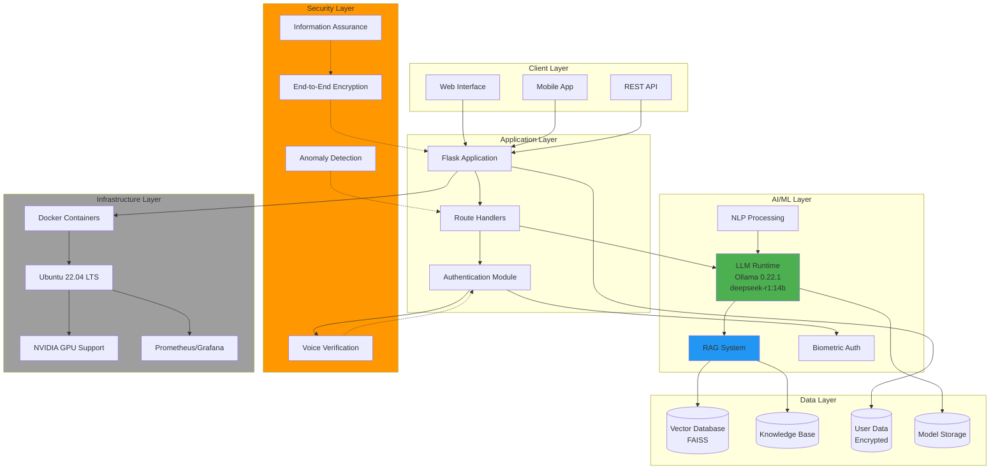
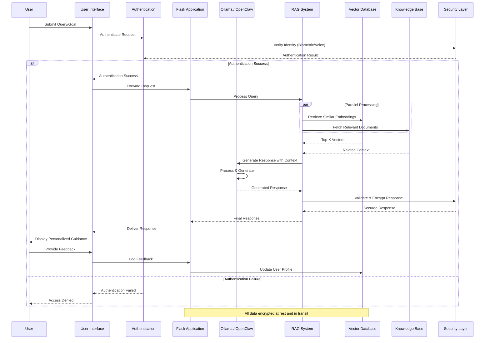
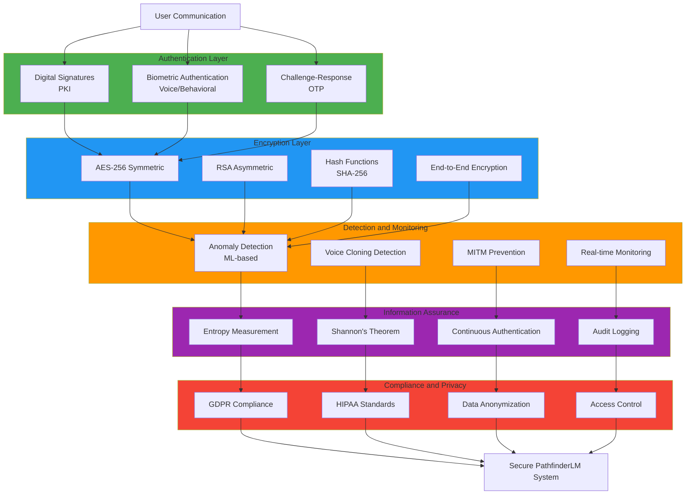
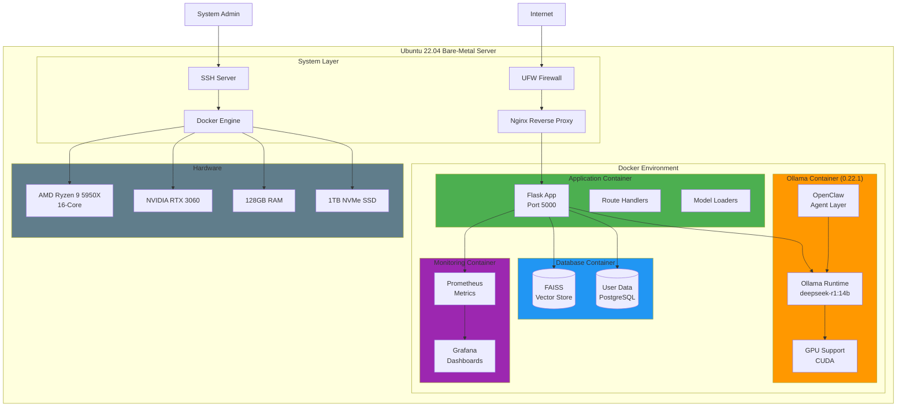

# PathfinderLM


**Personalized Life Coach System Leveraging Language Models and Retrieval Augmented Generation (RAG)**

<!-- Status & quality -->
[](https://github.com/danindiana/PathfinderLM/actions/workflows/ci.yml)
[](https://github.com/danindiana/PathfinderLM/actions/workflows/cd.yml)
[](LICENSE)
[](https://github.com/danindiana/PathfinderLM/actions/workflows/ci.yml)
[](https://codecov.io/gh/danindiana/PathfinderLM)
[](https://github.com/danindiana/PathfinderLM/graphs/commit-activity)
[](CONTRIBUTING.md)
[](https://www.conventionalcommits.org)

<!-- Language & runtime -->
[](https://www.python.org/)
[](https://pytorch.org/)
[](https://ollama.com/)
[](https://openclaw.ai/)
[](https://github.com/facebookresearch/faiss)
[](https://flask.palletsprojects.com/)

<!-- Infra & tooling -->
[](https://ubuntu.com/)
[](https://www.docker.com/)
[](https://github.com/psf/black)
[](https://pycqa.github.io/isort/)
[](https://github.com/PyCQA/bandit)
[](CODE_OF_CONDUCT.md)

> ⚠️ **Project status: pre-alpha / active development.** The architecture and
> features described below represent the *target* system. See the
> [Roadmap](#roadmap) and [STRUCTURE_IMPROVEMENTS.md](STRUCTURE_IMPROVEMENTS.md)
> for what is implemented today versus planned.

> 🩺 **Clinical disclaimer:** PathfinderLM is a self-improvement and educational
> tool. It is **not** a medical device and does **not** provide medical,
> psychological, or addiction-treatment advice. In a crisis, contact a licensed
> professional or your local emergency services.

## Table of Contents
- [Overview](#overview)
- [Architecture](#architecture)
  - [System Architecture](#system-architecture)
  - [RAG Pipeline](#rag-pipeline)
  - [Data Flow](#data-flow)
  - [Security Architecture](#security-architecture)
  - [Deployment Architecture](#deployment-architecture)
  - [Directory Structure](#directory-structure)
- [Key Features](#key-features)
- [Technology Stack](#technology-stack)
- [Quick Start](#quick-start)
- [Configuration](#configuration)
- [Make Targets](#make-targets)
- [Documentation](#documentation)
- [Project Status](#project-status)
- [Roadmap](#roadmap)
- [Contributing](#contributing)
- [Security Policy](#security-policy)
- [FAQ](#faq)
- [License](#license)

## Overview

PathfinderLM is an AI-powered life coaching system designed to guide users towards their personal goals and aspirations. It is **local-first**: language models run on your own hardware through the [Ollama](https://ollama.com/) 0.22.1 runtime (default model `deepseek-r1:14b`), orchestrated by the [OpenClaw](https://openclaw.ai/) agent layer, and combined with Retrieval Augmented Generation (RAG) to deliver a personalized, informative, and empathetic coaching experience. Cloud models (e.g. OpenAI GPT-4) remain available as an optional fallback.

The system runs on Ubuntu 22.04 bare-metal servers (or fully containerized via Docker) for maximum control, performance, and data privacy — making it suitable for both personal development and specialized applications such as substance cessation support.

## Architecture

### System Architecture


```mermaid
graph TB
    subgraph ClientLayer["Client Layer"]
        WebUI[Web Interface]
        MobileUI[Mobile App]
        API[REST API]
    end

    subgraph ApplicationLayer["Application Layer"]
        Flask[Flask Application]
        Routes[Route Handlers]
        Auth[Authentication Module]
    end

    subgraph AIMLLayer["AI/ML Layer"]
        LM[LLM Runtime<br/>Ollama 0.22.1<br/>deepseek-r1:14b]
        RAG[RAG System]
        NLP[NLP Processing]
        Biometric[Biometric Auth]
    end

    subgraph DataLayer["Data Layer"]
        VectorDB[(Vector Database<br/>FAISS)]
        KnowledgeBase[(Knowledge Base)]
        UserData[(User Data<br/>Encrypted)]
        Models[(Model Storage)]
    end

    subgraph SecurityLayer["Security Layer"]
        Encryption[End-to-End Encryption]
        VoiceVerif[Voice Verification]
        Anomaly[Anomaly Detection]
        IAFramework[Information Assurance]
    end

    subgraph InfrastructureLayer["Infrastructure Layer"]
        Docker[Docker Containers]
        Ubuntu[Ubuntu 22.04 LTS]
        GPU[NVIDIA GPU Support]
        Monitor[Prometheus/Grafana]
    end

    WebUI --> Flask
    MobileUI --> Flask
    API --> Flask
    Flask --> Routes
    Routes --> Auth
    Routes --> LM
    LM --> RAG
    RAG --> VectorDB
    RAG --> KnowledgeBase
    NLP --> LM
    Auth --> Biometric
    Auth --> VoiceVerif
    Flask --> UserData
    LM --> Models

    Encryption -.-> Flask
    VoiceVerif -.-> Auth
    Anomaly -.-> Routes
    IAFramework -.-> Encryption

    Flask --> Docker
    Docker --> Ubuntu
    Ubuntu --> GPU
    Ubuntu --> Monitor

    style LM fill:#4CAF50
    style RAG fill:#2196F3
    style SecurityLayer fill:#FF9800
    style InfrastructureLayer fill:#9E9E9E
```

### RAG Pipeline


```mermaid
graph LR
    subgraph InputProcessing["Input Processing"]
        UserQuery[User Query] --> Tokenize[Tokenization]
        Tokenize --> Embed[Query Embedding]
    end

    subgraph RetrievalPhase["Retrieval Phase"]
        Embed --> VectorSearch[Vector Similarity Search]
        VectorSearch --> FAISS[(FAISS Index)]
        FAISS --> TopK[Top-K Documents]
        KnowledgeBase[(Knowledge Base<br/>Articles, Advice, Research)] --> FAISS
    end

    subgraph AugmentationPhase["Augmentation Phase"]
        TopK --> ContextBuild[Context Building]
        UserQuery --> ContextBuild
        ContextBuild --> AugPrompt[Augmented Prompt]
    end

    subgraph GenerationPhase["Generation Phase"]
        AugPrompt --> LM[LLM Runtime<br/>Ollama 0.22.1<br/>deepseek-r1:14b]
        LM --> Response[Generated Response]
        Response --> PostProcess[Post-Processing]
        PostProcess --> Validation[Response Validation]
    end

    subgraph FeedbackLoop["Feedback Loop"]
        Validation --> UserFeedback{User Feedback}
        UserFeedback -->|Positive| UpdateRewards[Update Model Rewards]
        UserFeedback -->|Negative| RefinementQueue[Refinement Queue]
        RefinementQueue --> ContextBuild
    end

    Validation --> FinalResponse[Final Response to User]

    style RetrievalPhase fill:#E3F2FD
    style GenerationPhase fill:#FFF3E0
    style AugmentationPhase fill:#F3E5F5
    style FeedbackLoop fill:#E8F5E9
```

### Data Flow


```mermaid
sequenceDiagram
    participant U as User
    participant UI as User Interface
    participant Auth as Authentication
    participant App as Flask Application
    participant LM as Ollama / OpenClaw
    participant RAG as RAG System
    participant DB as Vector Database
    participant KB as Knowledge Base
    participant Sec as Security Layer

    U->>UI: Submit Query/Goal
    UI->>Auth: Authenticate Request
    Auth->>Sec: Verify Identity (Biometric/Voice)
    Sec-->>Auth: Authentication Result

    alt Authentication Success
        Auth-->>UI: Authentication Success
        UI->>App: Forward Request
        App->>RAG: Process Query

        par Parallel Processing
            RAG->>DB: Retrieve Similar Embeddings
            RAG->>KB: Fetch Relevant Documents
        end

        DB-->>RAG: Top-K Vectors
        KB-->>RAG: Related Context

        RAG->>LM: Generate Response with Context
        LM->>LM: Process & Generate
        LM-->>RAG: Generated Response

        RAG->>Sec: Validate & Encrypt Response
        Sec-->>RAG: Secured Response

        RAG-->>App: Final Response
        App-->>UI: Deliver Response
        UI-->>U: Display Personalized Guidance

        U->>UI: Provide Feedback
        UI->>App: Log Feedback
        App->>DB: Update User Profile
    else Authentication Failure
        Auth-->>UI: Authentication Failed
        UI-->>U: Access Denied
    end

    Note over App,DB: All data encrypted at rest and in transit
```

### Security Architecture


```mermaid
graph TD
    subgraph AuthenticationLayer["Authentication Layer"]
        A1[Digital Signatures<br/>PKI]
        A2[Biometric Authentication<br/>Voice/Behavioral]
        A3[Challenge-Response<br/>OTP]
    end

    subgraph EncryptionLayer["Encryption Layer"]
        E1[AES-256 Symmetric]
        E2[RSA Asymmetric]
        E3[Hash Functions<br/>SHA-256]
        E4[End-to-End Encryption]
    end

    subgraph DetectionMonitoring["Detection and Monitoring"]
        D1[Anomaly Detection<br/>ML-based]
        D2[Voice Cloning Detection]
        D3[MITM Prevention]
        D4[Real-time Monitoring]
    end

    subgraph InformationAssurance["Information Assurance"]
        IA1[Entropy Measurement]
        IA2[Shannon's Theorem]
        IA3[Continuous Authentication]
        IA4[Audit Logging]
    end

    subgraph CompliancePrivacy["Compliance and Privacy"]
        C1[GDPR Compliance]
        C2[HIPAA Standards]
        C3[Data Anonymization]
        C4[Access Control]
    end

    User[User Communication] --> A1
    User --> A2
    User --> A3

    A1 --> E1
    A2 --> E1
    A3 --> E1

    E1 --> D1
    E2 --> D1
    E3 --> D1
    E4 --> D1

    D1 --> IA1
    D2 --> IA2
    D3 --> IA3
    D4 --> IA4

    IA1 --> C1
    IA2 --> C2
    IA3 --> C3
    IA4 --> C4

    C1 --> SecureSystem[Secure PathfinderLM System]
    C2 --> SecureSystem
    C3 --> SecureSystem
    C4 --> SecureSystem

    style AuthenticationLayer fill:#4CAF50
    style EncryptionLayer fill:#2196F3
    style DetectionMonitoring fill:#FF9800
    style InformationAssurance fill:#9C27B0
    style CompliancePrivacy fill:#F44336
```

### Deployment Architecture


```mermaid
graph TB
    subgraph UbuntuServer["Ubuntu 22.04 Bare-Metal Server"]
        subgraph DockerEnv["Docker Environment"]
            subgraph AppContainer["Application Container"]
                Flask[Flask App<br/>Port 5000]
                Routes[Route Handlers]
                Models[Model Loaders]
            end

            subgraph DBContainer["Database Container"]
                VectorDB[(FAISS<br/>Vector Store)]
                UserDB[(User Data<br/>PostgreSQL)]
            end

            subgraph AIMLContainer["Ollama Container (0.22.1)"]
                GPU[GPU Support<br/>CUDA]
                OllamaRT[Ollama Runtime<br/>deepseek-r1:14b]
                OpenClaw[OpenClaw<br/>Agent Layer]
            end

            subgraph MonitorContainer["Monitoring Container"]
                Prometheus[Prometheus<br/>Metrics]
                Grafana[Grafana<br/>Dashboards]
            end
        end

        subgraph SystemLayer["System Layer"]
            Docker[Docker Engine]
            Nginx[Nginx Reverse Proxy]
            Firewall[UFW Firewall]
            SSH[SSH Server]
        end

        subgraph Hardware["Hardware"]
            CPU[AMD Ryzen 9 5950X<br/>16-Core]
            GPUHard[NVIDIA RTX 3060]
            RAM[128GB RAM]
            Storage[1TB NVMe SSD]
        end
    end

    Internet[Internet] --> Firewall
    Firewall --> Nginx
    Nginx --> Flask

    Flask --> VectorDB
    Flask --> UserDB
    Flask --> OllamaRT

    OllamaRT --> GPU
    OpenClaw --> OllamaRT

    Flask --> Prometheus
    Prometheus --> Grafana

    Docker --> CPU
    Docker --> GPUHard
    Docker --> RAM
    Docker --> Storage

    Admin[System Admin] --> SSH
    SSH --> Docker

    style AppContainer fill:#4CAF50
    style DBContainer fill:#2196F3
    style AIMLContainer fill:#FF9800
    style MonitorContainer fill:#9C27B0
    style Hardware fill:#607D8B
```

> 📐 **Prefer static images?** Graphviz re-creations of every diagram below —
> with PNG and SVG exports — live in [`diagrams/`](diagrams/). Regenerate them
> with `make diagrams` or `diagrams/render.sh`.

### Directory Structure


```mermaid
graph TD
    Root["/home/user/pathfinderlm/"]

    Root --> Config["📄 Configuration Files"]
    Config --> Dockerfile["Dockerfile"]
    Config --> DockerCompose["docker-compose.yml"]
    Config --> Requirements["requirements.txt"]
    Config --> GitIgnore[".gitignore"]

    Root --> App["📁 app/"]
    App --> MainPy["main.py"]
    App --> InitPy["__init__.py"]
    App --> Models["models/"]
    App --> Routes["routes/"]
    App --> Utils["utils/"]

    Models --> ModelPy["model.py"]
    Routes --> RoutesInit["__init__.py"]
    Routes --> AskPy["ask.py"]
    Utils --> UtilsInit["__init__.py"]
    Utils --> Preprocess["preprocessing.py"]
    Utils --> Postprocess["postprocessing.py"]

    Root --> Data["📁 data/"]
    Data --> Raw["raw/"]
    Data --> Processed["processed/"]
    Data --> Datasets["datasets/"]

    Raw --> UserData["user_data/"]
    Datasets --> TrainCSV["train.csv"]
    Datasets --> TestCSV["test.csv"]

    Root --> Scripts["📁 scripts/"]
    Scripts --> Train["train_model.py"]
    Scripts --> Evaluate["evaluate_model.py"]
    Scripts --> FineTune["fine_tune_model.py"]
    Scripts --> PreprocessScript["preprocess_data.py"]

    Root --> Docs["📁 docs/"]
    Docs --> Architecture["architecture.md"]
    Docs --> Setup["setup_guide.md"]
    Docs --> APIDoc["api_documentation.md"]
    Docs --> UserManual["user_manual.md"]

    Root --> Tests["📁 tests/"]
    Tests --> TestInit["__init__.py"]
    Tests --> TestApp["test_app.py"]
    Tests --> TestUtils["test_utils.py"]
    Tests --> TestModels["test_models.py"]

    Root --> Logs["📁 logs/"]
    Logs --> TrainingLog["training.log"]
    Logs --> AppLog["app.log"]

    Root --> Results["📁 results/"]
    Results --> ModelDir["model/"]
    ModelDir --> ConfigJSON["config.json"]
    ModelDir --> ModelBin["pytorch_model.bin"]
    ModelDir --> Tokenizer["tokenizer.json"]

    Root --> Configs["📁 configs/"]
    Configs --> ConfigYAML["config.yaml"]
    Configs --> LoggingConf["logging.conf"]

    Root --> Security["📁 ellipsis/"]
    Security --> IAFramework["InformationAssuranceFramework.md"]
    Security --> EllipsisMD["ellipsis.md"]
    Security --> Countermeasure["ellipsis_countermeasure.md"]

    style Root fill:#2196F3,color:#fff
    style App fill:#4CAF50,color:#fff
    style Data fill:#FF9800,color:#fff
    style Scripts fill:#9C27B0,color:#fff
    style Docs fill:#00BCD4,color:#fff
    style Tests fill:#E91E63,color:#fff
    style Security fill:#F44336,color:#fff
```

## Key Features

### Core Capabilities
- **Personalized Goal Setting**: Collaborative goal articulation across multiple life domains (career, relationships, personal growth, health)
- **Actionable Plans**: AI-generated personalized action plans with manageable steps and timelines
- **Ongoing Support**: Continuous encouragement, progress tracking, and adaptive planning
- **Knowledge Integration**: RAG-powered access to vast knowledge repositories for contextual advice
- **Emotional Intelligence**: Emotion detection and empathetic responses during challenging times
- **Privacy & Security**: End-to-end encryption with GDPR/HIPAA compliance

### Specialized Modules
- **Substance Cessation Support**: Personalized cessation plans for various dependencies
- **Therapeutic Techniques**: CBT, motivational interviewing, and mindfulness exercises
- **Comprehensive Monitoring**: Daily tracking of progress, mood, cravings, and triggers
- **Community Support**: Integration with support groups and professional resources

### Advanced Security
- **Voice Verification**: Biometric voice authentication to prevent impersonation
- **MITM Protection**: Advanced detection and prevention of man-in-the-middle attacks
- **Anomaly Detection**: ML-based detection of unusual patterns and potential threats
- **Information Assurance**: Information-theoretic authentication using entropy analysis

## Technology Stack

### AI/ML (local-first)
- **LLM Runtime**: [Ollama](https://ollama.com/) **0.22.1** (local, containerized)
- **Default Model**: `deepseek-r1:14b`
- **Agent Layer**: [OpenClaw](https://openclaw.ai/) — local-first, multi-model personal-AI assistant ([integration guide](docs/openclaw_integration.md))
- **Embeddings**: Ollama (`nomic-embed-text`)
- **Vector Search**: FAISS
- **NLP**: spaCy, NLTK
- **Optional cloud fallback**: OpenAI GPT-4 · HuggingFace Transformers / PyTorch

### Backend
- **Framework**: Flask
- **API**: REST API with JSON
- **Authentication**: JWT, PKI, Biometric

### Data
- **Vector DB**: FAISS (CPU/GPU)
- **Storage**: PostgreSQL, SQLite
- **Caching**: Redis

### Infrastructure
- **OS**: Ubuntu 22.04 LTS
- **Containerization**: Docker, Docker Compose
- **Reverse Proxy**: Nginx
- **Monitoring**: Prometheus, Grafana
- **Security**: UFW Firewall, SSL/TLS

### Hardware
- **CPU**: AMD Ryzen 9 5950X (16-Core)
- **GPU**: NVIDIA GeForce RTX 3060
- **RAM**: 128GB DDR4
- **Storage**: 1TB NVMe SSD

## Quick Start

### Prerequisites
```bash
# Ubuntu 22.04 LTS
# Docker & Docker Compose installed
# NVIDIA GPU drivers (optional, for GPU acceleration)
```

### Installation

1. **Clone the repository**
   ```bash
   git clone https://github.com/danindiana/PathfinderLM.git
   cd PathfinderLM
   ```

2. **Set up environment variables**
   ```bash
   cp .env.example .env
   # Edit .env with your configuration
   ```

3. **Start the Ollama runtime and pull the models** (first run only)
   ```bash
   docker compose up -d ollama
   docker compose exec ollama ollama pull deepseek-r1:14b
   docker compose exec ollama ollama pull nomic-embed-text
   ```

4. **Build and run the application**
   ```bash
   docker compose up --build app
   ```

5. **Access the application**
   ```
   Web UI:     http://localhost:5000
   API:        http://localhost:5000/api
   Ollama API: http://localhost:11434
   ```

> The `ollama` service uses the `ollama/ollama:0.22.1` image with a persistent
> `ollama_models` volume, so models are pulled only once. GPU acceleration
> requires the NVIDIA Container Toolkit (see `docker-compose.yml`).

### Manual Setup (Without Docker)

```bash
# Install dependencies
sudo apt update && sudo apt upgrade -y
sudo apt install python3 python3-pip -y

# Install Python packages
pip3 install -r requirements.txt

# (Optional) bake the coaching persona into a named model
make model            # ollama create pathfinder-coach -f Modelfile
# export MODEL_NAME=pathfinder-coach

# Build the retrieval index from the seed corpus
python3 scripts/build_index.py

# Run the application
python3 app/main.py
```

See the [Setup Guide](docs/setup_guide.md) for the full walkthrough and the
[API Documentation](docs/api_documentation.md) for endpoint details.

## Configuration

PathfinderLM is configured through environment variables (loaded from a `.env`
file via `python-dotenv`) and YAML files under `configs/`. Copy the example and
edit to taste:

```bash
cp .env.example .env
```

| Variable | Default | Description |
|----------|---------|-------------|
| `FLASK_ENV` | `production` | `development` enables debug + autoreload |
| `FLASK_PORT` | `5000` | Port the Flask app binds to |
| `LLM_PROVIDER` | `ollama` | LLM backend: `ollama` (local) or `openai` (cloud fallback) |
| `OLLAMA_HOST` | `http://ollama:11434` | Ollama runtime endpoint (`http://localhost:11434` outside Docker) |
| `MODEL_NAME` | `deepseek-r1:14b` | Ollama model used for generation/reasoning |
| `EMBEDDING_MODEL` | `nomic-embed-text` | Ollama embedding model for the FAISS index |
| `OPENAI_API_KEY` | _(unset)_ | Required only when `LLM_PROVIDER=openai` |
| `SYSTEM_PROMPT` | _(coaching persona)_ | Overrides the system-role persona text |
| `FAISS_INDEX_PATH` | `results/faiss.index` | On-disk location of the vector index |
| `KNOWLEDGE_BASE_DIR` | `data/processed` | Source documents ingested into the index |
| `TOP_K` | `5` | Number of documents retrieved per query |
| `DEVICE` | `auto` | `cpu`, `cuda`, or `auto` (detects GPU) |
| `LOG_LEVEL` | `INFO` | Python logging level |
| `SECRET_KEY` | _(unset)_ | Flask session signing key — **set in production** |

> **Never commit `.env`.** It is already listed in [`.gitignore`](.gitignore).
> Use a secrets manager (Docker secrets, Vault, or systemd `EnvironmentFile`)
> for production deployments.

## Make Targets

The project ships a [`Makefile`](Makefile) that wraps the most common workflows.
Run `make help` for the full list:

| Target | Description |
|--------|-------------|
| `make install` | Install production dependencies |
| `make install-dev` | Install dev/test/lint tooling |
| `make test` | Run the unit-test suite (`pytest`) |
| `make lint` | Run flake8 + pylint + mypy |
| `make format` | Auto-format with black + isort |
| `make security` | Run bandit + safety scans |
| `make docker-build` | Build the container image |
| `make docker-run` | Run the app in a container |
| `make smoke-test` | Execute the post-deploy smoke tests |
| `make deploy` | Deploy via `scripts/deploy.sh` |
| `make clean` | Remove build artifacts and caches |
| `make all` | `clean` → `lint` → `test` → `security` → `build` |

## Documentation

Detailed documentation is available in the [`docs/`](docs/) directory:

- **[API Documentation](docs/api_documentation.md)**: Endpoint reference (`/ask`, `/health`, `/metrics`)
- **[Architecture](docs/architecture.md)**: Components and request flow
- **[Setup Guide](docs/setup_guide.md)**: Local, Docker, and bare-metal installation
- **[User Manual](docs/user_manual.md)**: End-user guide
- **[OpenClaw Integration](docs/openclaw_integration.md)**: Drive PathfinderLM from the OpenClaw agent
- **[Mission & Vision](mission.md)**: Project goals and philosophy
- **[Software Stack](ground_game.md)**: Complete technical stack details
- **[Directory Structure](tree.md)**: Detailed project structure
- **[Security Framework](ellipsis/)**: Information assurance and security details
- **[Structure Improvements](STRUCTURE_IMPROVEMENTS.md)**: Recommended organizational improvements

### API Documentation

**POST /ask**: Submit a question with context
```bash
curl -X POST http://localhost:5000/ask \
  -H "Content-Type: application/json" \
  -d '{
    "question": "How can I improve my productivity?",
    "context": "I struggle with time management and procrastination."
  }'
```

Response:
```json
{
  "answer": "Based on your context...",
  "score": 0.95,
  "suggestions": [...]
}
```

## Development

### Project Structure
See the [Directory Structure](#directory-structure) diagram above for complete project organization.

### Running Tests
```bash
python3 -m pytest tests/
```

### Training Models
```bash
python3 scripts/train_model.py
```

### Monitoring
- Prometheus: http://localhost:9090
- Grafana: http://localhost:3000

## Project Status

| Area | Status | Notes |
|------|--------|-------|
| Documentation & architecture | ✅ Established | README, mission, security framework, diagrams |
| CI/CD pipeline | ✅ Established | GitHub Actions (lint, test, security, build, deploy) |
| Build automation | ✅ Established | `Makefile` + bare-metal scripts |
| Core RAG pipeline | 🚧 In progress | Retrieval + generation glue code |
| Web / mobile UI | 📋 Planned | See [Roadmap](#roadmap) |
| Voice biometric auth | 📋 Planned | Information-assurance design complete |
| Wearable integration | 📋 Planned | Holistic health tracking |

Legend: ✅ done · 🚧 in progress · 📋 planned. The authoritative implementation
checklist lives in [STRUCTURE_IMPROVEMENTS.md](STRUCTURE_IMPROVEMENTS.md).

## Contributing

Contributions are welcome! Please read [CONTRIBUTING.md](CONTRIBUTING.md) and our
[Code of Conduct](CODE_OF_CONDUCT.md) before opening a PR. The
[STRUCTURE_IMPROVEMENTS.md](STRUCTURE_IMPROVEMENTS.md) file lists areas that
currently need development.

### Development Process
1. Fork the repository
2. Create a feature branch (`git checkout -b feature/amazing-feature`)
3. Install dev tooling (`make install-dev`)
4. Make your changes; keep the suite green (`make lint test security`)
5. Commit using [Conventional Commits](https://www.conventionalcommits.org)
   (`git commit -m 'feat: add amazing feature'`)
6. Push to the branch (`git push origin feature/amazing-feature`)
7. Open a Pull Request against `main`

## Security Policy

Found a vulnerability? **Please do not open a public issue.** Follow the
responsible-disclosure process documented in [SECURITY.md](SECURITY.md). We aim
to acknowledge reports within 72 hours.

## FAQ

<details>
<summary><strong>Does PathfinderLM call out to a cloud LLM API?</strong></summary>

The reference design runs models locally on a bare-metal Ubuntu host for privacy
and control. The model layer is pluggable — you can swap in a hosted API by
changing `MODEL_NAME` and the model loader, but the default posture is
local-first / no-data-egress.
</details>

<details>
<summary><strong>Can I run it without a GPU?</strong></summary>

Yes. Set `DEVICE=cpu` and use `faiss-cpu` (the default in `requirements.txt`).
Generation will be slower with large models; prefer a smaller model for CPU-only
hosts.
</details>

<details>
<summary><strong>Is this a replacement for therapy or medical treatment?</strong></summary>

No. See the clinical disclaimer at the top of this README. PathfinderLM is an
educational/self-improvement aid and is not a substitute for licensed
professional care.
</details>

<details>
<summary><strong>Where do I report bugs vs. ask questions?</strong></summary>

Bugs and feature requests → [GitHub Issues](https://github.com/danindiana/PathfinderLM/issues).
Open-ended questions and ideas → [GitHub Discussions](https://github.com/danindiana/PathfinderLM/discussions).
Security issues → [SECURITY.md](SECURITY.md).
</details>

## Ethical Considerations

PathfinderLM is designed with strong ethical principles:
- **Privacy First**: All user data is encrypted and anonymized
- **Bias Mitigation**: Active measures to identify and reduce AI biases
- **Human Connection**: AI augments but doesn't replace human support
- **Transparency**: Clear communication about AI capabilities and limitations
- **Autonomy**: Users maintain full control over their data and decisions

## Roadmap

- [ ] Implement core RAG pipeline
- [ ] Develop web and mobile interfaces
- [ ] Integrate voice biometric authentication
- [ ] Add multi-modal input support (voice, images)
- [ ] Integrate with wearables for holistic health tracking
- [ ] Develop gamification features
- [ ] Create community support platform
- [ ] Add multi-language support
- [ ] Implement advanced analytics dashboard

## License

This project is licensed under the Apache License 2.0 - see the [LICENSE](LICENSE) file for details.

## Support

For issues, questions, or contributions:
- **Issues**: [GitHub Issues](https://github.com/danindiana/PathfinderLM/issues)
- **Discussions**: [GitHub Discussions](https://github.com/danindiana/PathfinderLM/discussions)

## Acknowledgments

- Powered by [Ollama](https://ollama.com/) for local model serving
- Agent layer by [OpenClaw](https://openclaw.ai/) — "the AI that actually does things"
- Also supports [HuggingFace Transformers](https://huggingface.co/transformers/) / [PyTorch](https://pytorch.org/) for the optional cloud fallback path
- Inspired by advances in RAG and LLM research

---

**Note**: This project is under active development. The structure and features described represent the planned architecture. See [STRUCTURE_IMPROVEMENTS.md](STRUCTURE_IMPROVEMENTS.md) for implementation status and recommendations.

**PathfinderLM** - Empowering personal growth through AI-powered guidance 🚀
