# PathfinderLM


**Personalized Life Coach System Leveraging Language Models and Retrieval Augmented Generation (RAG)**

[](LICENSE)
[](https://www.python.org/)
[](https://ubuntu.com/)

## Table of Contents
- [Overview](#overview)
- [Architecture](#architecture)
  - [System Architecture](#system-architecture)
  - [RAG Pipeline](#rag-pipeline)
  - [Data Flow](#data-flow)
  - [Security Architecture](#security-architecture)
  - [Deployment Architecture](#deployment-architecture)
  - [Directory Structure](#directory-structure)
- [Key Features](#key-features)
- [Technology Stack](#technology-stack)
- [Quick Start](#quick-start)
- [Documentation](#documentation)
- [Contributing](#contributing)
- [License](#license)

## Overview

PathfinderLM is an AI-powered life coaching system designed to guide users towards their personal goals and aspirations. By combining cutting-edge language models (like GPT-4, BERT) with Retrieval Augmented Generation (RAG) technology, PathfinderLM delivers a personalized, informative, and empathetic coaching experience.

The system runs on Ubuntu 22.04 bare-metal servers for maximum control, performance, and data privacy, making it suitable for both personal development and specialized applications such as substance cessation support.

## Architecture

### System Architecture

```mermaid
graph TB
    subgraph "Client Layer"
        WebUI[Web Interface]
        MobileUI[Mobile App]
        API[REST API]
    end

    subgraph "Application Layer"
        Flask[Flask Application]
        Routes[Route Handlers]
        Auth[Authentication Module]
    end

    subgraph "AI/ML Layer"
        LM[Language Model<br/>GPT-4/BERT]
        RAG[RAG System]
        NLP[NLP Processing]
        Biometric[Biometric Auth]
    end

    subgraph "Data Layer"
        VectorDB[(Vector Database<br/>FAISS/Pinecone)]
        KnowledgeBase[(Knowledge Base)]
        UserData[(User Data<br/>Encrypted)]
        Models[(Model Storage)]
    end

    subgraph "Security Layer"
        Encryption[End-to-End Encryption]
        VoiceVerif[Voice Verification]
        Anomaly[Anomaly Detection]
        IAFramework[Information Assurance]
    end

    subgraph "Infrastructure Layer"
        Docker[Docker Containers]
        Ubuntu[Ubuntu 22.04 LTS]
        GPU[NVIDIA GPU Support]
        Monitor[Prometheus/Grafana]
    end

    WebUI --> Flask
    MobileUI --> Flask
    API --> Flask
    Flask --> Routes
    Routes --> Auth
    Routes --> LM
    LM --> RAG
    RAG --> VectorDB
    RAG --> KnowledgeBase
    NLP --> LM
    Auth --> Biometric
    Auth --> VoiceVerif
    Flask --> UserData
    LM --> Models

    Encryption -.-> Flask
    VoiceVerif -.-> Auth
    Anomaly -.-> Routes
    IAFramework -.-> Security Layer

    Flask --> Docker
    Docker --> Ubuntu
    Ubuntu --> GPU
    Ubuntu --> Monitor

    style LM fill:#4CAF50
    style RAG fill:#2196F3
    style Security Layer fill:#FF9800
    style Infrastructure Layer fill:#9E9E9E
```

### RAG Pipeline


### Data Flow


### Security Architecture

```mermaid
graph TD
    subgraph "Authentication Layer"
        A1[Digital Signatures<br/>PKI]
        A2[Biometric Authentication<br/>Voice/Behavioral]
        A3[Challenge-Response<br/>OTP]
    end

    subgraph "Encryption Layer"
        E1[AES-256 Symmetric]
        E2[RSA Asymmetric]
        E3[Hash Functions<br/>SHA-256]
        E4[End-to-End Encryption]
    end

    subgraph "Detection & Monitoring"
        D1[Anomaly Detection<br/>ML-based]
        D2[Voice Cloning Detection]
        D3[MITM Prevention]
        D4[Real-time Monitoring]
    end

    subgraph "Information Assurance"
        IA1[Entropy Measurement]
        IA2[Shannon's Theorem]
        IA3[Continuous Authentication]
        IA4[Audit Logging]
    end

    subgraph "Compliance & Privacy"
        C1[GDPR Compliance]
        C2[HIPAA Standards]
        C3[Data Anonymization]
        C4[Access Control]
    end

    User[User Communication] --> A1
    User --> A2
    User --> A3

    A1 --> E1
    A2 --> E1
    A3 --> E1

    E1 --> D1
    E2 --> D1
    E3 --> D1
    E4 --> D1

    D1 --> IA1
    D2 --> IA2
    D3 --> IA3
    D4 --> IA4

    IA1 --> C1
    IA2 --> C2
    IA3 --> C3
    IA4 --> C4

    C1 --> SecureSystem[Secure PathfinderLM System]
    C2 --> SecureSystem
    C3 --> SecureSystem
    C4 --> SecureSystem

    style Authentication Layer fill:#4CAF50
    style Encryption Layer fill:#2196F3
    style Detection & Monitoring fill:#FF9800
    style Information Assurance fill:#9C27B0
    style Compliance & Privacy fill:#F44336
```

### Deployment Architecture


### Directory Structure

```mermaid
graph TD
    Root["/home/user/pathfinderlm/"]

    Root --> Config["📄 Configuration Files"]
    Config --> Dockerfile["Dockerfile"]
    Config --> DockerCompose["docker-compose.yml"]
    Config --> Requirements["requirements.txt"]
    Config --> GitIgnore[".gitignore"]

    Root --> App["📁 app/"]
    App --> MainPy["main.py"]
    App --> InitPy["__init__.py"]
    App --> Models["models/"]
    App --> Routes["routes/"]
    App --> Utils["utils/"]

    Models --> ModelPy["model.py"]
    Routes --> RoutesInit["__init__.py"]
    Routes --> AskPy["ask.py"]
    Utils --> UtilsInit["__init__.py"]
    Utils --> Preprocess["preprocessing.py"]
    Utils --> Postprocess["postprocessing.py"]

    Root --> Data["📁 data/"]
    Data --> Raw["raw/"]
    Data --> Processed["processed/"]
    Data --> Datasets["datasets/"]

    Raw --> UserData["user_data/"]
    Datasets --> TrainCSV["train.csv"]
    Datasets --> TestCSV["test.csv"]

    Root --> Scripts["📁 scripts/"]
    Scripts --> Train["train_model.py"]
    Scripts --> Evaluate["evaluate_model.py"]
    Scripts --> FineTune["fine_tune_model.py"]
    Scripts --> PreprocessScript["preprocess_data.py"]

    Root --> Docs["📁 docs/"]
    Docs --> Architecture["architecture.md"]
    Docs --> Setup["setup_guide.md"]
    Docs --> APIDoc["api_documentation.md"]
    Docs --> UserManual["user_manual.md"]

    Root --> Tests["📁 tests/"]
    Tests --> TestInit["__init__.py"]
    Tests --> TestApp["test_app.py"]
    Tests --> TestUtils["test_utils.py"]
    Tests --> TestModels["test_models.py"]

    Root --> Logs["📁 logs/"]
    Logs --> TrainingLog["training.log"]
    Logs --> AppLog["app.log"]

    Root --> Results["📁 results/"]
    Results --> ModelDir["model/"]
    ModelDir --> ConfigJSON["config.json"]
    ModelDir --> ModelBin["pytorch_model.bin"]
    ModelDir --> Tokenizer["tokenizer.json"]

    Root --> Configs["📁 configs/"]
    Configs --> ConfigYAML["config.yaml"]
    Configs --> LoggingConf["logging.conf"]

    Root --> Security["📁 ellipsis/"]
    Security --> IAFramework["InformationAssuranceFramework.md"]
    Security --> EllipsisMD["ellipsis.md"]
    Security --> Countermeasure["ellipsis_countermeasure.md"]

    style Root fill:#2196F3,color:#fff
    style App fill:#4CAF50,color:#fff
    style Data fill:#FF9800,color:#fff
    style Scripts fill:#9C27B0,color:#fff
    style Docs fill:#00BCD4,color:#fff
    style Tests fill:#E91E63,color:#fff
    style Security fill:#F44336,color:#fff
```



## Key Features

### Core Capabilities
- **Personalized Goal Setting**: Collaborative goal articulation across multiple life domains (career, relationships, personal growth, health)
- **Actionable Plans**: AI-generated personalized action plans with manageable steps and timelines
- **Ongoing Support**: Continuous encouragement, progress tracking, and adaptive planning
- **Knowledge Integration**: RAG-powered access to vast knowledge repositories for contextual advice
- **Emotional Intelligence**: Emotion detection and empathetic responses during challenging times
- **Privacy & Security**: End-to-end encryption with GDPR/HIPAA compliance

### Specialized Modules
- **Substance Cessation Support**: Personalized cessation plans for various dependencies
- **Therapeutic Techniques**: CBT, motivational interviewing, and mindfulness exercises
- **Comprehensive Monitoring**: Daily tracking of progress, mood, cravings, and triggers
- **Community Support**: Integration with support groups and professional resources

### Advanced Security
- **Voice Verification**: Biometric voice authentication to prevent impersonation
- **MITM Protection**: Advanced detection and prevention of man-in-the-middle attacks
- **Anomaly Detection**: ML-based detection of unusual patterns and potential threats
- **Information Assurance**: Information-theoretic authentication using entropy analysis

## Technology Stack

### AI/ML
- **Language Models**: GPT-4, BERT, Transformers
- **Frameworks**: PyTorch, TensorFlow, HuggingFace Transformers
- **Vector Search**: FAISS, Sentence-Transformers
- **NLP**: spaCy, NLTK

### Backend
- **Framework**: Flask
- **API**: REST API with JSON
- **Authentication**: JWT, PKI, Biometric

### Data
- **Vector DB**: FAISS (CPU/GPU)
- **Storage**: PostgreSQL, SQLite
- **Caching**: Redis

### Infrastructure
- **OS**: Ubuntu 22.04 LTS
- **Containerization**: Docker, Docker Compose
- **Reverse Proxy**: Nginx
- **Monitoring**: Prometheus, Grafana
- **Security**: UFW Firewall, SSL/TLS

### Hardware
- **CPU**: AMD Ryzen 9 5950X (16-Core)
- **GPU**: NVIDIA GeForce RTX 3060
- **RAM**: 128GB DDR4
- **Storage**: 1TB NVMe SSD

## Quick Start

### Prerequisites
```bash
# Ubuntu 22.04 LTS
# Docker & Docker Compose installed
# NVIDIA GPU drivers (optional, for GPU acceleration)
```

### Installation

1. **Clone the repository**
   ```bash
   git clone https://github.com/danindiana/PathfinderLM.git
   cd PathfinderLM
   ```

2. **Set up environment variables**
   ```bash
   cp .env.example .env
   # Edit .env with your configuration
   ```

3. **Build and run with Docker**
   ```bash
   docker-compose up --build
   ```

4. **Access the application**
   ```
   Web UI: http://localhost:5000
   API: http://localhost:5000/api
   ```

### Manual Setup (Without Docker)

```bash
# Install dependencies
sudo apt update && sudo apt upgrade -y
sudo apt install python3 python3-pip -y

# Install Python packages
pip3 install -r requirements.txt

# Run the application
python3 app/main.py
```

## Documentation

Detailed documentation is available in the [`docs/`](docs/) directory:

- **[Mission & Vision](mission.md)**: Project goals and philosophy
- **[Software Stack](ground_game.md)**: Complete technical stack details
- **[Directory Structure](tree.md)**: Detailed project structure
- **[Security Framework](ellipsis/)**: Information assurance and security details
- **[Structure Improvements](STRUCTURE_IMPROVEMENTS.md)**: Recommended organizational improvements

### API Documentation

**POST /ask**: Submit a question with context
```bash
curl -X POST http://localhost:5000/ask \
  -H "Content-Type: application/json" \
  -d '{
    "question": "How can I improve my productivity?",
    "context": "I struggle with time management and procrastination."
  }'
```

Response:
```json
{
  "answer": "Based on your context...",
  "score": 0.95,
  "suggestions": [...]
}
```

## Development

### Project Structure
See the [Directory Structure](#directory-structure) diagram above for complete project organization.

### Running Tests
```bash
python3 -m pytest tests/
```

### Training Models
```bash
python3 scripts/train_model.py
```

### Monitoring
- Prometheus: http://localhost:9090
- Grafana: http://localhost:3000

## Contributing

We welcome contributions! Please see our [STRUCTURE_IMPROVEMENTS.md](STRUCTURE_IMPROVEMENTS.md) for areas that need development.

### Development Process
1. Fork the repository
2. Create a feature branch (`git checkout -b feature/amazing-feature`)
3. Commit your changes (`git commit -m 'Add amazing feature'`)
4. Push to the branch (`git push origin feature/amazing-feature`)
5. Open a Pull Request

## Ethical Considerations

PathfinderLM is designed with strong ethical principles:
- **Privacy First**: All user data is encrypted and anonymized
- **Bias Mitigation**: Active measures to identify and reduce AI biases
- **Human Connection**: AI augments but doesn't replace human support
- **Transparency**: Clear communication about AI capabilities and limitations
- **Autonomy**: Users maintain full control over their data and decisions

## Roadmap

- [ ] Implement core RAG pipeline
- [ ] Develop web and mobile interfaces
- [ ] Integrate voice biometric authentication
- [ ] Add multi-modal input support (voice, images)
- [ ] Integrate with wearables for holistic health tracking
- [ ] Develop gamification features
- [ ] Create community support platform
- [ ] Add multi-language support
- [ ] Implement advanced analytics dashboard

## License

This project is licensed under the Apache License 2.0 - see the [LICENSE](LICENSE) file for details.

## Support

For issues, questions, or contributions:
- **Issues**: [GitHub Issues](https://github.com/danindiana/PathfinderLM/issues)
- **Discussions**: [GitHub Discussions](https://github.com/danindiana/PathfinderLM/discussions)

## Acknowledgments

- Built with [HuggingFace Transformers](https://huggingface.co/transformers/)
- Powered by [PyTorch](https://pytorch.org/)
- Inspired by advances in RAG and LLM research

---

**Note**: This project is under active development. The structure and features described represent the planned architecture. See [STRUCTURE_IMPROVEMENTS.md](STRUCTURE_IMPROVEMENTS.md) for implementation status and recommendations.

**PathfinderLM** - Empowering personal growth through AI-powered guidance 🚀
