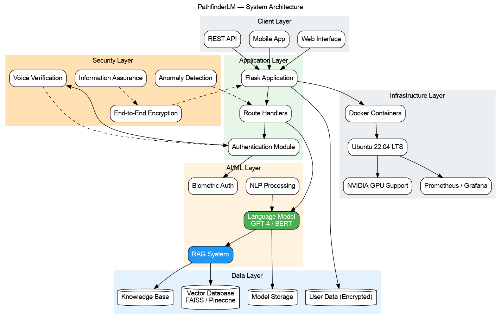
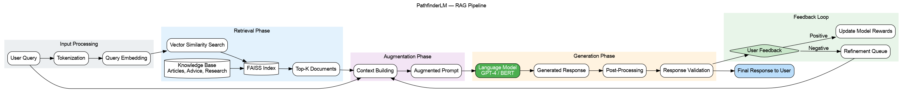
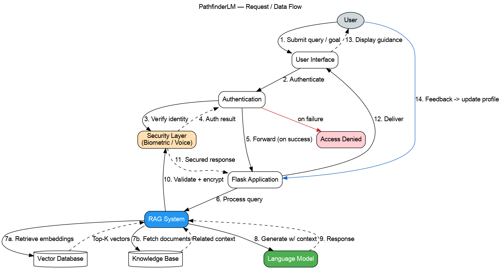
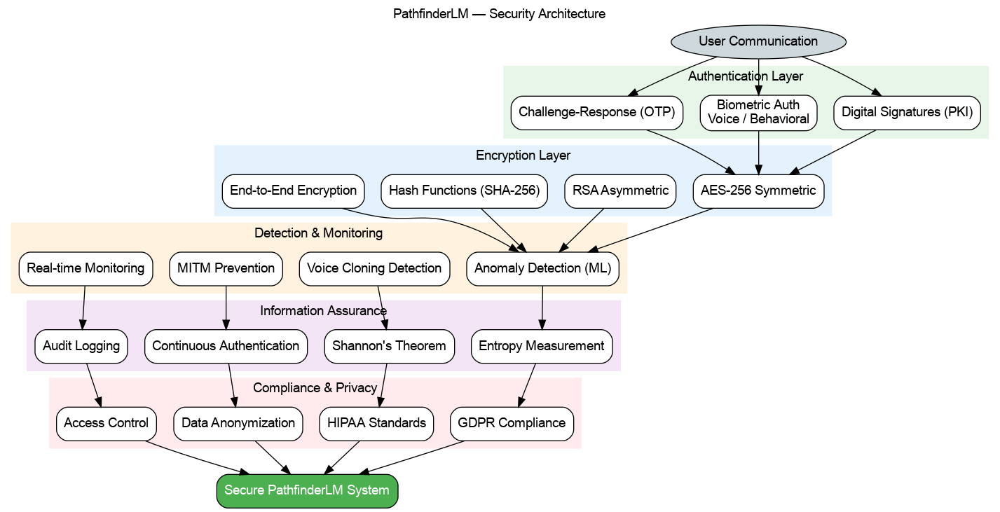
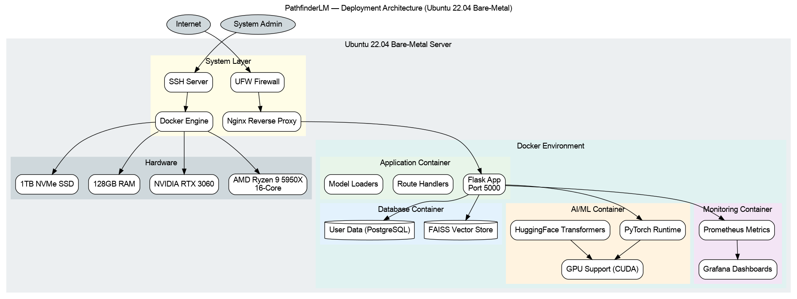
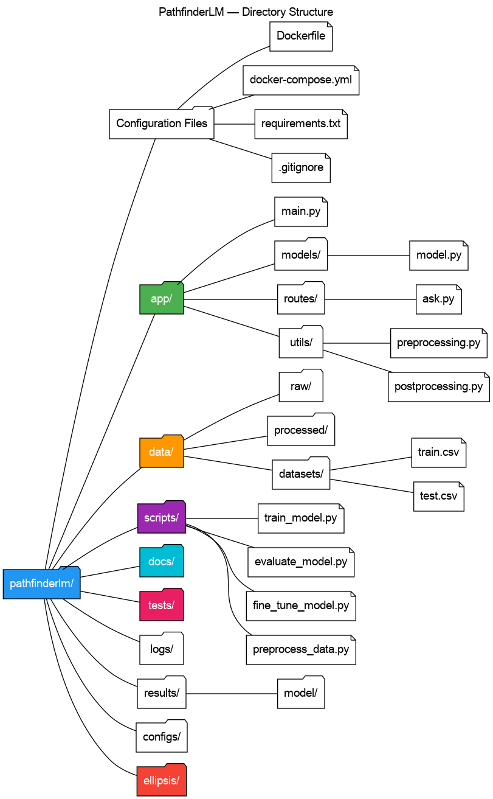

# PathfinderLM Diagrams

Graphviz (`.dot`) re-creations of the architecture diagrams from the project
[README](../README.md), with rendered **PNG** and **SVG** exports.

These mirror the Mermaid diagrams embedded in the README — Mermaid renders
inline on GitHub, while these Graphviz exports give you portable, high-resolution
images for slide decks, docs, and printing.

## Diagrams

| Diagram | Source | PNG | SVG |
|---------|--------|-----|-----|
| System Architecture | [`system_architecture.dot`](system_architecture.dot) | [PNG](system_architecture.png) | [SVG](system_architecture.svg) |
| RAG Pipeline | [`rag_pipeline.dot`](rag_pipeline.dot) | [PNG](rag_pipeline.png) | [SVG](rag_pipeline.svg) |
| Data / Request Flow | [`data_flow.dot`](data_flow.dot) | [PNG](data_flow.png) | [SVG](data_flow.svg) |
| Security Architecture | [`security_architecture.dot`](security_architecture.dot) | [PNG](security_architecture.png) | [SVG](security_architecture.svg) |
| Deployment Architecture | [`deployment_architecture.dot`](deployment_architecture.dot) | [PNG](deployment_architecture.png) | [SVG](deployment_architecture.svg) |
| Directory Structure | [`directory_structure.dot`](directory_structure.dot) | [PNG](directory_structure.png) | [SVG](directory_structure.svg) |

## Previews

### System Architecture


### RAG Pipeline


### Data / Request Flow


### Security Architecture


### Deployment Architecture


### Directory Structure


## Regenerating

Edit the `.dot` source files, then re-export PNG + SVG:

```bash
# Requires graphviz
sudo apt install graphviz

# Regenerate every diagram
./render.sh
```

Or render a single diagram manually:

```bash
dot -Tpng system_architecture.dot -o system_architecture.png
dot -Tsvg system_architecture.dot -o system_architecture.svg
```

## Notes

- The **Data / Request Flow** diagram was a Mermaid *sequence* diagram in the
  README; Graphviz has no native sequence-diagram type, so it is rendered as a
  numbered directed flow that preserves the same ordering and branches.
- Colors and cluster groupings intentionally match the README's Mermaid styling.
