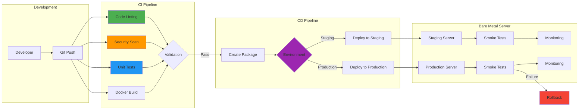
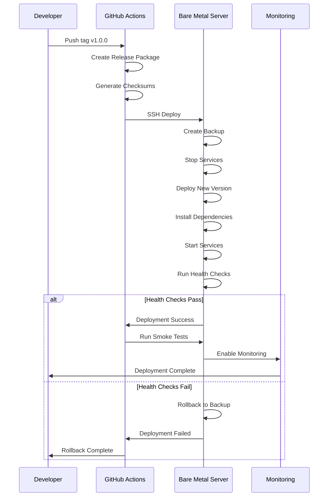

# PathfinderLM CI/CD Pipeline Guide

## Table of Contents
- [Overview](#overview)
- [Architecture](#architecture)
- [CI Pipeline](#ci-pipeline)
- [CD Pipeline](#cd-pipeline)
- [Bare Metal Deployment](#bare-metal-deployment)
- [Smoke Testing](#smoke-testing)
- [Monitoring & Validation](#monitoring--validation)
- [Troubleshooting](#troubleshooting)

## Overview

PathfinderLM uses a comprehensive CI/CD pipeline designed for bare metal Ubuntu 22.04 servers. The pipeline includes automated testing, security scanning, Docker containerization, and production-grade deployment with rollback capabilities.

### Key Features

- **Automated CI/CD**: GitHub Actions workflows for continuous integration and deployment
- **Multi-stage Testing**: Linting, security scanning, unit tests, and smoke tests
- **Bare Metal Optimized**: Scripts optimized for Ubuntu 22.04 bare metal servers
- **GPU Support**: NVIDIA GPU driver installation and CUDA support
- **Rollback Capability**: Automatic rollback on deployment failure
- **Monitoring**: Prometheus and Grafana integration
- **Security**: Fail2Ban, UFW firewall, and security scanning

## Architecture



## CI Pipeline

### Workflow: `.github/workflows/ci.yml`

The CI pipeline runs on every push and pull request, executing the following jobs:

#### 1. Code Linting

```bash
# Run manually
make lint

# Or individual linters
black --check app/ scripts/ tests/
isort --check-only app/ scripts/ tests/
flake8 app/ scripts/ tests/
pylint app/ scripts/
mypy app/ scripts/
```

**What it checks:**
- Code formatting (Black)
- Import ordering (isort)
- Code quality (Flake8, Pylint)
- Type hints (MyPy)

#### 2. Security Scanning

```bash
# Run manually
make security

# Or individual tools
bandit -r app/ scripts/
safety check -r requirements.txt
```

**What it checks:**
- Common security issues (Bandit)
- Known vulnerabilities in dependencies (Safety)

#### 3. Unit & Integration Tests

```bash
# Run tests
make test

# Run with coverage
make test-coverage
```

**Test matrix:**
- Python 3.9, 3.10, 3.11
- Coverage reporting via Codecov

#### 4. Docker Build & Scan

```bash
# Build Docker image
make docker-build

# Run container
make docker-run

# Stop container
make docker-stop
```

**What it does:**
- Builds Docker image with BuildKit
- Runs Trivy vulnerability scanner
- Tests container startup

#### 5. Smoke Tests

```bash
# Run smoke tests
make smoke-test

# Or directly
./scripts/smoke_test.sh
```

**What it tests:**
- Service availability
- Health endpoints
- Response times
- Resource usage

## CD Pipeline

### Workflow: `.github/workflows/cd.yml`

The CD pipeline handles deployment to staging and production environments.

### Deployment Environments

#### Staging
- **Trigger**: Manual workflow dispatch
- **URL**: https://staging.pathfinderlm.local
- **Purpose**: Pre-production testing

#### Production
- **Trigger**: Git tags (v*.*.*)
- **URL**: https://pathfinderlm.local
- **Purpose**: Live production environment

### Deployment Process



### Manual Deployment

```bash
# Deploy to staging
make deploy-staging

# Deploy to production (requires confirmation)
make deploy-production

# Or use the script directly
sudo ./scripts/deploy.sh production
```

## Bare Metal Deployment

### Initial Server Setup

#### 1. Server Requirements

**Hardware:**
- CPU: 8+ cores (AMD Ryzen 9 5950X recommended)
- RAM: 32GB minimum (128GB recommended)
- GPU: NVIDIA GPU (RTX 3060 or better)
- Storage: 256GB SSD minimum (1TB NVMe recommended)

**Software:**
- Ubuntu 22.04 LTS (fresh installation)
- Root/sudo access
- Internet connectivity

#### 2. First-Time Setup

```bash
# Clone repository
git clone https://github.com/danindiana/PathfinderLM.git
cd PathfinderLM

# Run bare metal setup (requires root)
sudo ./scripts/setup_bare_metal.sh
```

**What it installs:**
- Python 3.10
- Docker & Docker Compose
- NVIDIA drivers & CUDA (if GPU detected)
- Prometheus & Grafana
- Firewall (UFW)
- Fail2Ban
- System optimizations

#### 3. Post-Setup Steps

```bash
# Reboot if NVIDIA drivers were installed
sudo reboot

# Verify installation
docker --version
python3 --version
nvidia-smi  # If GPU available

# Check firewall status
sudo ufw status

# Verify services
systemctl status docker
systemctl status fail2ban
systemctl status prometheus
```

### Directory Structure

```
/opt/pathfinderlm/          # Application root
├── app/                    # Application code
├── data/                   # Data storage
│   ├── raw/               # Raw data
│   ├── processed/         # Processed data
│   └── datasets/          # Training datasets
├── logs/                  # Application logs
├── results/               # Model outputs
│   └── model/            # Trained models
├── scripts/              # Deployment scripts
├── configs/              # Configuration files
└── venv/                 # Python virtual environment

/opt/backups/pathfinderlm/ # Backup storage
/var/log/pathfinderlm/     # System logs
```

### Deployment Configuration

#### Systemd Service

The deployment script creates a systemd service at `/etc/systemd/system/pathfinderlm.service`:

```ini
[Unit]
Description=PathfinderLM AI Life Coach Service
After=network.target

[Service]
Type=simple
User=pathfinder
Group=pathfinder
WorkingDirectory=/opt/pathfinderlm
Environment="PATH=/opt/pathfinderlm/venv/bin"
ExecStart=/opt/pathfinderlm/venv/bin/python3 /opt/pathfinderlm/app/main.py
Restart=always
RestartSec=10

[Install]
WantedBy=multi-user.target
```

#### Service Management

```bash
# Start service
sudo systemctl start pathfinderlm

# Stop service
sudo systemctl stop pathfinderlm

# Restart service
sudo systemctl restart pathfinderlm

# Check status
sudo systemctl status pathfinderlm

# View logs
sudo journalctl -u pathfinderlm -f

# Enable auto-start
sudo systemctl enable pathfinderlm
```

## Smoke Testing

### Test Suite Overview

The smoke test suite (`scripts/smoke_test.sh`) validates:

1. **Service Health**
   - Service running (systemd/Docker)
   - Port listening (5000)
   - Health endpoint accessible

2. **API Functionality**
   - Endpoints responding
   - Response times < 3s
   - Correct status codes

3. **System Resources**
   - Sufficient disk space (>10GB)
   - Available memory (>4GB)
   - Log files present

4. **Dependencies**
   - Python imports working
   - Required packages installed

5. **Security**
   - Security headers present
   - Firewall configured

### Running Smoke Tests

```bash
# Local environment
./scripts/smoke_test.sh local

# Staging environment
BASE_URL=https://staging.pathfinderlm.local ./scripts/smoke_test.sh staging

# Production environment
BASE_URL=https://pathfinderlm.local ./scripts/smoke_test.sh production
```

### Sample Output

```
========================================
PathfinderLM Smoke Test Suite
Environment: production
Base URL: http://localhost:5000
========================================

[TEST] Testing if service is running...
[PASS] Systemd service is running
[TEST] Testing if port is listening...
[PASS] Port 5000 is listening
[TEST] Testing health endpoint...
[PASS] Health endpoint is accessible
[TEST] Testing API endpoint...
[PASS] API endpoint returned 200 OK
[TEST] Testing response time...
[PASS] Response time: 245ms (excellent)

========================================
Test Results
========================================
Passed: 12
Failed: 0
========================================
All smoke tests PASSED
```

## Monitoring & Validation

### Prometheus Metrics

Access Prometheus at: http://server-ip:9090

**Key Metrics:**
- `pathfinderlm_requests_total` - Total requests
- `pathfinderlm_request_duration_seconds` - Request latency
- `pathfinderlm_model_inference_time` - Model inference time
- `pathfinderlm_active_users` - Active users

### Grafana Dashboards

Access Grafana at: http://server-ip:3000

**Default Credentials:**
- Username: `admin`
- Password: `admin` (change on first login)

**Recommended Dashboards:**
1. Application Performance
2. System Resources
3. Request Analytics
4. Error Monitoring

### Health Checks

```bash
# Application health
curl http://localhost:5000/health

# System health
./scripts/smoke_test.sh

# Service status
systemctl status pathfinderlm
```

### Log Monitoring

```bash
# Application logs
tail -f /opt/pathfinderlm/logs/app.log

# Error logs
tail -f /opt/pathfinderlm/logs/error.log

# Systemd logs
journalctl -u pathfinderlm -f

# Deployment logs
tail -f /var/log/pathfinderlm/deploy.log
```

## Troubleshooting

### Common Issues

#### 1. Deployment Fails

**Symptoms:**
- Deployment script exits with error
- Service fails to start

**Solutions:**
```bash
# Check service status
systemctl status pathfinderlm

# Check logs
journalctl -u pathfinderlm -n 100 --no-pager

# Verify dependencies
cd /opt/pathfinderlm
source venv/bin/activate
pip list

# Manual rollback
sudo ./scripts/deploy.sh rollback
```

#### 2. Service Won't Start

**Symptoms:**
- Service status shows "failed"
- Port not listening

**Solutions:**
```bash
# Check port conflicts
sudo netstat -tulpn | grep :5000

# Verify permissions
ls -la /opt/pathfinderlm

# Check Python environment
cd /opt/pathfinderlm
source venv/bin/activate
python3 app/main.py  # Run manually to see errors
```

#### 3. Smoke Tests Fail

**Symptoms:**
- Tests report failures
- Endpoints not responding

**Solutions:**
```bash
# Verify service is running
systemctl status pathfinderlm

# Check firewall
sudo ufw status
sudo ufw allow 5000/tcp

# Test endpoint manually
curl -v http://localhost:5000/health

# Check resource usage
free -h
df -h
```

#### 4. Out of Memory

**Symptoms:**
- Service crashes
- OOM killer messages in logs

**Solutions:**
```bash
# Check memory usage
free -h

# Check swap
swapon --show

# Increase swap if needed
sudo fallocate -l 16G /swapfile
sudo chmod 600 /swapfile
sudo mkswap /swapfile
sudo swapon /swapfile

# Add to fstab for persistence
echo '/swapfile none swap sw 0 0' | sudo tee -a /etc/fstab
```

#### 5. GPU Not Detected

**Symptoms:**
- CUDA errors
- nvidia-smi fails

**Solutions:**
```bash
# Check GPU
lspci | grep -i nvidia

# Reinstall drivers
sudo ubuntu-drivers autoinstall

# Reboot
sudo reboot

# Verify after reboot
nvidia-smi
```

### Getting Help

If issues persist:

1. **Check Logs**: Review all log files for error messages
2. **GitHub Issues**: https://github.com/danindiana/PathfinderLM/issues
3. **Documentation**: Review project documentation
4. **Community**: Join discussions on GitHub

### Emergency Rollback

```bash
# Find last backup
ls -lt /opt/backups/pathfinderlm/

# Stop current version
sudo systemctl stop pathfinderlm

# Restore from backup
cd /opt/backups/pathfinderlm/YYYYMMDD_HHMMSS
sudo tar -xzf pathfinderlm.tar.gz -C /opt/

# Restart service
sudo systemctl start pathfinderlm

# Verify
./scripts/smoke_test.sh
```

## Best Practices

### Development Workflow

1. **Branch Strategy**
   - `main`: Production-ready code
   - `develop`: Integration branch
   - `feature/*`: Feature branches
   - `hotfix/*`: Emergency fixes

2. **Pre-commit Checks**
   ```bash
   make validate  # Runs lint, security, tests
   ```

3. **Testing Locally**
   ```bash
   make docker-build
   make docker-run
   make smoke-test
   ```

### Deployment Strategy

1. **Staging First**: Always deploy to staging before production
2. **Tag Releases**: Use semantic versioning (v1.0.0)
3. **Monitor Metrics**: Watch dashboards during deployment
4. **Gradual Rollout**: Use blue-green or canary deployments for large changes

### Security Best Practices

1. **Keep System Updated**
   ```bash
   sudo apt update && sudo apt upgrade -y
   ```

2. **Regular Backups**: Automated daily backups
3. **Monitor Logs**: Regular log review for suspicious activity
4. **SSL/TLS**: Use HTTPS in production
5. **Secrets Management**: Never commit secrets to git

## Quick Reference

### Common Commands

```bash
# Build & Test
make all                    # Complete build pipeline
make test-coverage         # Run tests with coverage
make validate              # Pre-commit validation

# Deployment
make deploy-staging        # Deploy to staging
make deploy-production     # Deploy to production
make smoke-test           # Run smoke tests

# Docker
make docker-build         # Build image
make docker-run           # Run container
make docker-stop          # Stop container
make docker-logs          # View logs

# Maintenance
make clean                # Clean artifacts
systemctl restart pathfinderlm  # Restart service
journalctl -u pathfinderlm -f   # View logs
```

### File Locations

| Item | Location |
|------|----------|
| Application | `/opt/pathfinderlm/` |
| Backups | `/opt/backups/pathfinderlm/` |
| Logs | `/var/log/pathfinderlm/` |
| Service Config | `/etc/systemd/system/pathfinderlm.service` |
| CI/CD Workflows | `.github/workflows/` |
| Deployment Scripts | `scripts/` |

---

**PathfinderLM CI/CD Pipeline** - Built for bare metal Ubuntu 22.04 with GPU support
