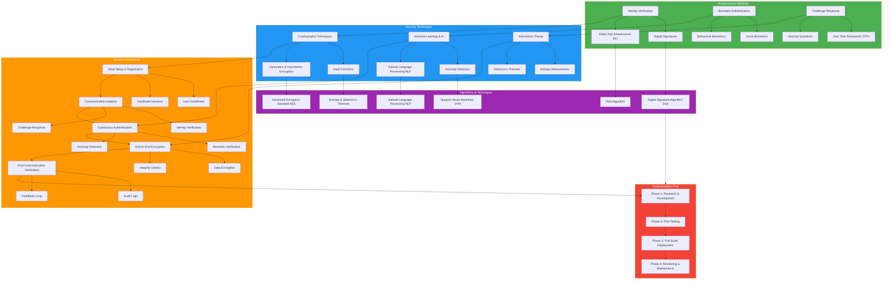

```mermaid
graph TB
    subgraph AuthMethods["Authentication Methods"]
        A[Identity Verification]
        A1[Digital Signatures]
        A2[Public Key Infrastructure PKI]
        B[Biometric Authentication]
        B1[Voice Biometrics]
        B2[Behavioral Biometrics]
        C[Challenge-Response]
        C1[One-Time Passwords OTPs]
        C2[Security Questions]

        A --> A1
        A --> A2
        B --> B1
        B --> B2
        C --> C1
        C --> C2
    end

    subgraph SecTech["Security Techniques"]
        D[Cryptographic Techniques]
        D1[Hash Functions]
        D2[Symmetric & Asymmetric Encryption]
        E[Machine Learning & AI]
        E1[Anomaly Detection]
        E2[Natural Language Processing NLP]
        F[Information Theory]
        F1[Entropy Measurement]
        F2[Shannon's Theorem]

        D --> D1
        D --> D2
        E --> E1
        E --> E2
        F --> F1
        F --> F2
    end

    subgraph SysArch["System Architecture"]
        G1[Initial Setup & Registration]
        G1a[User Enrollment]
        G1b[Certificate Issuance]
        G2[Communication Initiation]
        G2a[Identity Verification]
        G2b[Challenge-Response]
        G3[Continuous Authentication]
        G3a[Biometric Verification]
        G3b[Anomaly Detection]
        G4[End-to-End Encryption]
        G4a[Data Encryption]
        G4b[Integrity Checks]
        G5[Post-Communication Verification]
        G5a[Audit Logs]
        G5b[Feedback Loop]

        G1 --> G1a
        G1 --> G1b
        G2 --> G2a
        G2 --> G2b
        G3 --> G3a
        G3 --> G3b
        G4 --> G4a
        G4 --> G4b
        G5 --> G5a
        G5 --> G5b

        G1 --> G2 --> G3 --> G4 --> G5
    end

    subgraph AlgTech["Algorithms & Techniques"]
        H1[Digital Signature Algorithm DSA]
        H2[Advanced Encryption Standard AES]
        H3[RSA Algorithm]
        H4[Support Vector Machines SVM]
        H5[Natural Language Processing NLP]
        H6[Entropy & Shannon's Theorem]
    end

    subgraph ImplPlan["Implementation Plan"]
        I1[Phase 1: Research & Development]
        I2[Phase 2: Pilot Testing]
        I3[Phase 3: Full-Scale Deployment]
        I4[Phase 4: Monitoring & Maintenance]

        I1 --> I2 --> I3 --> I4
    end

    %% Framework Flow
    A --> D
    B --> E
    C --> F
    D --> G1
    E --> G3
    F --> G4

    A1 --> H1
    A2 --> H3
    D1 --> H6
    D2 --> H2
    E1 --> H4
    E2 --> H5

    G5 --> I1
    AlgTech --> ImplPlan

    style AuthMethods fill:#4CAF50,color:#fff
    style SecTech fill:#2196F3,color:#fff
    style SysArch fill:#FF9800,color:#fff
    style AlgTech fill:#9C27B0,color:#fff
    style ImplPlan fill:#F44336,color:#fff
```
