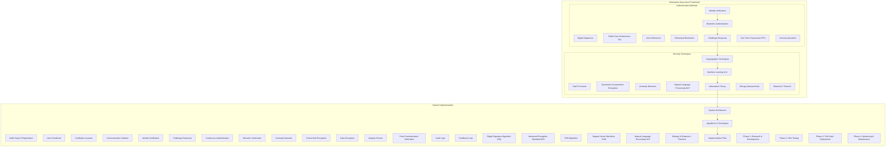

```mermaid
graph TD
    subgraph Information Assurance Framework
        subgraph Authentication Methods
            A[Identity Verification]
                A1[Digital Signatures]
                A2[Public Key Infrastructure PKI]
            B[Biometric Authentication]
                B1[Voice Biometrics]
                B2[Behavioral Biometrics]
            C[Challenge-Response]
                C1[One-Time Passwords OTPs]
                C2[Security Questions]
        end
        subgraph Security Techniques
            D[Cryptographic Techniques]
                D1[Hash Functions]
                D2[Symmetric & Asymmetric Encryption]
            E[Machine Learning & AI]
                E1[Anomaly Detection]
                E2[Natural Language Processing NLP]
            F[Information Theory]
                F1[Entropy Measurement]
                F2[Shannon's Theorem] 
        end
    end

    subgraph System Implementation 
        G[System Architecture]
            G1[Initial Setup & Registration]
                G1a[User Enrollment]
                G1b[Certificate Issuance]
            G2[Communication Initiation]
                G2a[Identity Verification]
                G2b[Challenge-Response]
            G3[Continuous Authentication]
                G3a[Biometric Verification]
                G3b[Anomaly Detection]
            G4[End-to-End Encryption]
                G4a[Data Encryption]
                G4b[Integrity Checks]
            G5[Post-Communication Verification]
                G5a[Audit Logs]
                G5b[Feedback Loop]
        H[Algorithms & Techniques]
            H1[Digital Signature Algorithm DSA]
            H2[Advanced Encryption Standard AES]
            H3[RSA Algorithm]
            H4[Support Vector Machines SVM]
            H5[Natural Language Processing NLP]
            H6[Entropy & Shannon's Theorem]
        I[Implementation Plan]
            I1[Phase 1: Research & Development]
            I2[Phase 2: Pilot Testing]
            I3[Phase 3: Full-Scale Deployment]
            I4[Phase 4: Monitoring & Maintenance]
    end
    
    A --> B --> C --> D --> E --> F
    F --> G
    G --> H --> I
```
