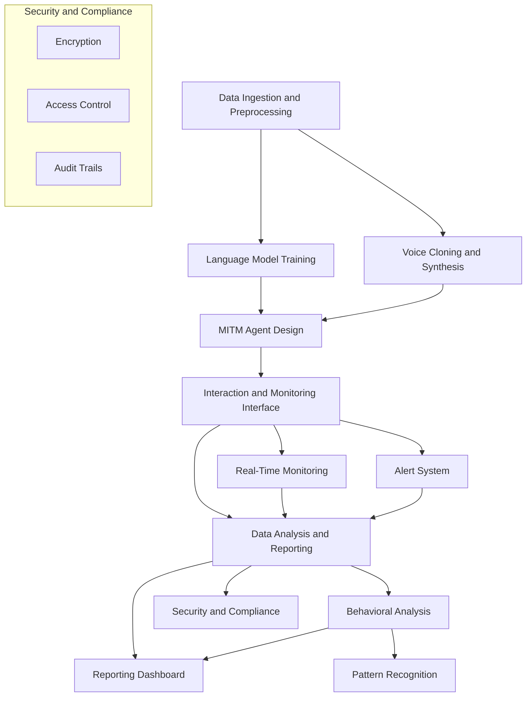

```mermaid
graph TD
    A[Data Ingestion and Preprocessing] --> B[Language Model Training]
    A --> C[Voice Cloning and Synthesis]
    B --> D[MITM Agent Design]
    C --> D
    D --> E[Interaction and Monitoring Interface]
    E --> F[Data Analysis and Reporting]
    E --> G[Real-Time Monitoring]
    E --> H[Alert System]
    F --> I[Reporting Dashboard]
    G --> F
    H --> F
    F --> J[Behavioral Analysis]
    J --> K[Pattern Recognition]
    J --> I
    subgraph Security and Compliance
        L[Encryption]
        M[Access Control]
        N[Audit Trails]
    end
    F --> Security[Security and Compliance]
```
