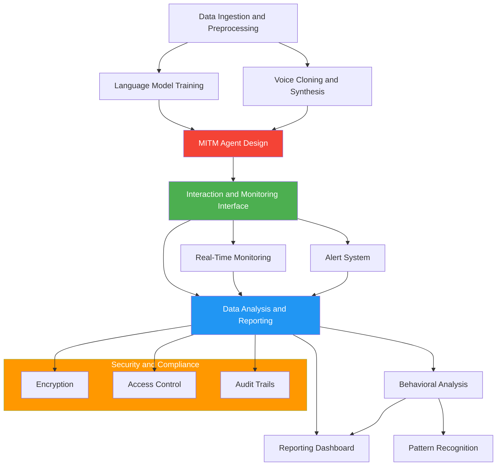

```mermaid
graph TD
    A[Data Ingestion and Preprocessing] --> B[Language Model Training]
    A --> C[Voice Cloning and Synthesis]
    B --> D[MITM Agent Design]
    C --> D
    D --> E[Interaction and Monitoring Interface]
    E --> F[Data Analysis and Reporting]
    E --> G[Real-Time Monitoring]
    E --> H[Alert System]
    F --> I[Reporting Dashboard]
    G --> F
    H --> F
    F --> J[Behavioral Analysis]
    J --> K[Pattern Recognition]
    J --> I

    subgraph SecurityCompliance["Security and Compliance"]
        L[Encryption]
        M[Access Control]
        N[Audit Trails]
    end

    F --> L
    F --> M
    F --> N

    style SecurityCompliance fill:#FF9800,color:#fff
    style D fill:#F44336,color:#fff
    style E fill:#4CAF50,color:#fff
    style F fill:#2196F3,color:#fff
```
