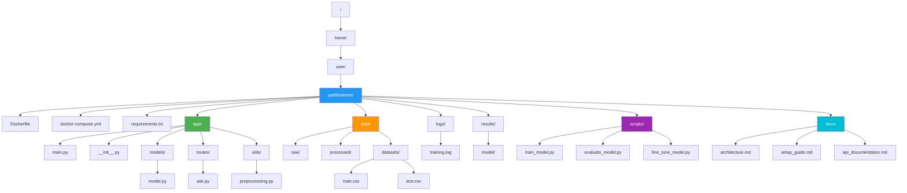

Here is the software stack setup for PathFinderLM refactored as a bash tree directory structure:

```plaintext
/
├── home/
│   └── user/
│       └── pathfinderlm/
│           ├── Dockerfile
│           ├── docker-compose.yml
│           ├── requirements.txt
│           ├── app/
│           │   ├── main.py
│           │   ├── __init__.py
│           │   ├── models/
│           │   │   ├── model.py
│           │   ├── routes/
│           │   │   ├── __init__.py
│           │   │   ├── ask.py
│           │   └── utils/
│           │       ├── __init__.py
│           │       ├── preprocessing.py
│           ├── data/
│           │   ├── raw/
│           │   ├── processed/
│           │   └── datasets/
│           │       ├── train.csv
│           │       ├── test.csv
│           ├── logs/
│           │   ├── training.log
│           ├── results/
│           │   ├── model/
│           ├── scripts/
│           │   ├── train_model.py
│           │   ├── evaluate_model.py
│           │   ├── fine_tune_model.py
│           └── docs/
│               ├── architecture.md
│               ├── setup_guide.md
│               └── api_documentation.md
```

### Contents of Key Files

#### Dockerfile
```Dockerfile
# Base image
FROM ubuntu:22.04

# Install dependencies
RUN apt-get update && apt-get install -y python3-pip

# Copy application files
COPY . /app/
WORKDIR /app/

# Install Python dependencies
RUN pip3 install -r requirements.txt

# Expose the port
EXPOSE 5000

# Command to run the application
CMD ["python3", "app/main.py"]
```

#### docker-compose.yml
```yaml
version: '3.8'

services:
  app:
    build: .
    container_name: pathfinderlm_app
    ports:
      - "5000:5000"
    volumes:
      - .:/app
    environment:
      - LANG=en_US.UTF-8
      - LC_ALL=en_US.UTF-8
```

#### requirements.txt
```plaintext
ollama
faiss-cpu
flask
# optional cloud/HF fallback: torch transformers sentence-transformers openai
```

#### app/main.py
```python
import os
from flask import Flask, request, jsonify
from ollama import Client

app = Flask(__name__)
client = Client(host=os.getenv("OLLAMA_HOST", "http://localhost:11434"))
MODEL = os.getenv("MODEL_NAME", "deepseek-r1:14b")

@app.route('/ask', methods=['POST'])
def ask():
    data = request.json
    question = data.get("question")
    context = data.get("context", "")
    prompt = f"Context:\n{context}\n\nQuestion: {question}"
    result = client.generate(model=MODEL, prompt=prompt)
    return jsonify({"answer": result["response"]})

if __name__ == '__main__':
    app.run(host='0.0.0.0', port=int(os.getenv("FLASK_PORT", 5000)))
```

#### scripts/build_index.py
```python
# Build the FAISS index from the knowledge base using Ollama embeddings
# (nomic-embed-text). Customizing the assistant is done via an Ollama Modelfile
# (system prompt + parameters), not by fine-tuning weights.
import os, faiss, numpy as np
from ollama import Client

client = Client(host=os.getenv("OLLAMA_HOST", "http://localhost:11434"))
EMBED_MODEL = os.getenv("EMBEDDING_MODEL", "nomic-embed-text")

def embed(text: str) -> np.ndarray:
    resp = client.embeddings(model=EMBED_MODEL, prompt=text)
    return np.array(resp["embedding"], dtype="float32")

def build(docs: list[str], index_path="results/faiss.index"):
    vectors = np.vstack([embed(d) for d in docs])
    index = faiss.IndexFlatL2(vectors.shape[1])
    index.add(vectors)
    faiss.write_index(index, index_path)
```

This structure organizes the various components and scripts for PathFinderLM, ensuring clarity and maintainability of the project.

Sure! Here's a more detailed and complete directory structure for the PathFinderLM project:

```plaintext
/
├── home/
│   └── user/
│       └── pathfinderlm/
│           ├── Dockerfile
│           ├── docker-compose.yml
│           ├── requirements.txt
│           ├── app/
│           │   ├── main.py
│           │   ├── __init__.py
│           │   ├── models/
│           │   │   ├── model.py
│           │   ├── routes/
│           │   │   ├── __init__.py
│           │   │   ├── ask.py
│           │   ├── utils/
│           │       ├── __init__.py
│           │       ├── preprocessing.py
│           │       ├── postprocessing.py
│           │       ├── helpers.py
│           ├── data/
│           │   ├── raw/
│           │   │   ├── user_data/
│           │   │       ├── user_1.json
│           │   │       ├── user_2.json
│           │   ├── processed/
│           │   │   ├── cleaned_data.csv
│           │   └── datasets/
│           │       ├── train.csv
│           │       ├── test.csv
│           ├── logs/
│           │   ├── training.log
│           │   ├── app.log
│           ├── results/
│           │   ├── model/
│           │       ├── config.json
│           │       ├── pytorch_model.bin
│           │       ├── tokenizer.json
│           ├── scripts/
│           │   ├── train_model.py
│           │   ├── evaluate_model.py
│           │   ├── fine_tune_model.py
│           │   ├── preprocess_data.py
│           │   ├── postprocess_results.py
│           ├── docs/
│           │   ├── architecture.md
│           │   ├── setup_guide.md
│           │   ├── api_documentation.md
│           │   ├── user_manual.md
│           ├── tests/
│           │   ├── __init__.py
│           │   ├── test_app.py
│           │   ├── test_utils.py
│           │   ├── test_models.py
│           └── configs/
│               ├── config.yaml
│               ├── logging.conf
```

### Contents of Additional Key Files

#### app/models/model.py
```python
import os
from ollama import Client

def get_client():
    return Client(host=os.getenv("OLLAMA_HOST", "http://localhost:11434"))

DEFAULT_MODEL = os.getenv("MODEL_NAME", "deepseek-r1:14b")
```

#### app/routes/ask.py
```python
import os
from flask import Blueprint, request, jsonify
from ollama import Client

ask_bp = Blueprint('ask', __name__)
client = Client(host=os.getenv("OLLAMA_HOST", "http://localhost:11434"))
MODEL = os.getenv("MODEL_NAME", "deepseek-r1:14b")

@ask_bp.route('/ask', methods=['POST'])
def ask():
    data = request.json
    question = data.get("question")
    context = data.get("context", "")
    prompt = f"Context:\n{context}\n\nQuestion: {question}"
    result = client.generate(model=MODEL, prompt=prompt)
    return jsonify({"answer": result["response"]})
```

#### app/utils/postprocessing.py
```python
def format_answer(answer):
    return {
        "answer": answer['answer'],
        "score": answer['score']
    }
```

#### scripts/preprocess_data.py
```python
import pandas as pd

def preprocess(file_path):
    data = pd.read_csv(file_path)
    # Perform cleaning operations
    data = data.dropna()
    data.to_csv('data/processed/cleaned_data.csv', index=False)

if __name__ == "__main__":
    preprocess('data/raw/user_data/user_1.json')
```

#### scripts/postprocess_results.py
```python
def postprocess(results):
    # Process results
    processed_results = []
    for result in results:
        processed_results.append({
            "answer": result['answer'],
            "confidence": result['score']
        })
    return processed_results

if __name__ == "__main__":
    results = [
        {"answer": "example answer 1", "score": 0.95},
        {"answer": "example answer 2", "score": 0.85}
    ]
    processed_results = postprocess(results)
    print(processed_results)
```

#### docs/user_manual.md
```markdown
# PathFinderLM User Manual

## Introduction
PathFinderLM is a personalized life coach system that leverages state-of-the-art language models and retrieval-augmented generation (RAG) technology.

## Installation
Follow the setup guide in `setup_guide.md` to install and configure PathFinderLM on your server.

## Usage
To use PathFinderLM, you can interact with it via the provided web interface or through API endpoints.

### API Endpoints
- `/ask` (POST): Submit a question and context to get an answer.

## Troubleshooting
For common issues, refer to the troubleshooting section in `setup_guide.md`.

## Support
For further assistance, contact support at support@example.com.
```

#### tests/test_app.py
```python
import unittest
from app import app

class AppTestCase(unittest.TestCase):
    def setUp(self):
        self.app = app.test_client()

    def test_ask_endpoint(self):
        response = self.app.post('/ask', json={
            'question': 'What is the capital of France?',
            'context': 'France is a country in Europe.'
        })
        self.assertEqual(response.status_code, 200)
        self.assertIn('answer', response.json)

if __name__ == '__main__':
    unittest.main()
```

This extended structure adds more detail and completeness to the PathFinderLM project, covering essential components like preprocessing and postprocessing scripts, logging configuration, test cases, and user documentation.
